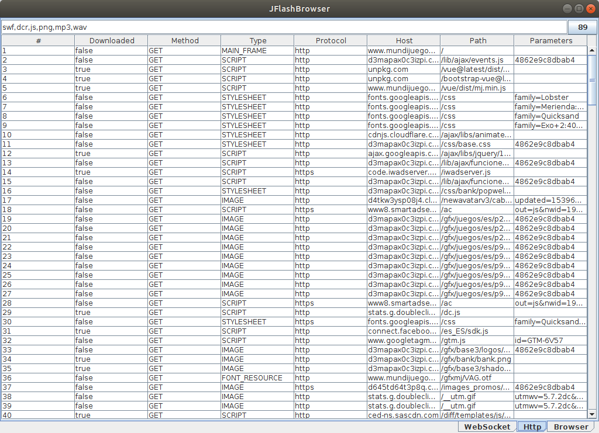

# JFlashBrowser

Simple WebBrowser with Flash support.
Tested on MacOS, Windows and Linux.

# Requirements

* Java 8
* Maven 3
* Make (Optional)

How to play


```
mvn package
mv target/jflash-browser-1.0-jar-with-dependencies.jar jflash.jar
java -jar jflash.jar
```


or

```
make run
```

Browser

 

Downloader

 

Click on upper right button to open the folder with downloaded files, following the filter by extension.


# References

* [JxBrowser](https://www.teamdev.com/jxbrowser) 

* [Shockwave player](https://helpx.adobe.com/shockwave.html?red=a)

* [Flash player](https://helpx.adobe.com/flash-player.html)

